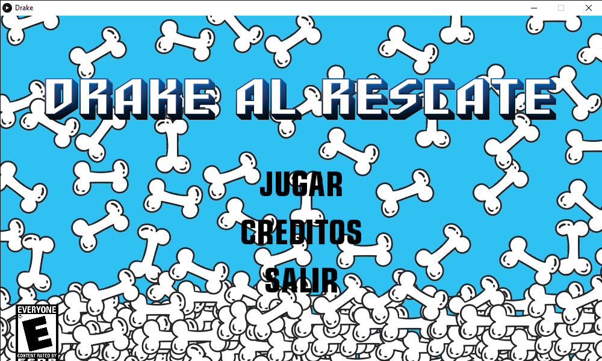

# JUEGO:

**Este es un proyecto en desarrollo**
##### `DRAKE AL RESCATE` es un proyecto privado, creado por:
##### Samuel Leal
##### Karen Rangel

### Descripción del proyecto:
Luego de que su mejor amiga fuera raptada y encerrada en una bola de cristal, Drake deberá atravesar diferentes mundos, recolectando huesos y sumando puntos, con el fin de poder rescatar a su dueña.
## Género:
Videojuego de Plataformas.
## Clasificación:
   Apto para todo publico.
   
   

## Requisistos
•La funcion del juego esta sujeta a descargar la libreria minim.
## Galeria:
•Nuestro protagonista (Drake):

•Nuestro menú principal:

•Control de juego:

•Para volver al menu principal:

## Caracteristicas:
•El jugador tendra tres vidas para completar todos los niveles, al perder sus vidas debera volver a comenzar desde el principio.

• Tiene una musica agradable y divertiva.   
• Su ambientacion es colorida.    
• Es dinamico, interactivo y entretenido.   
• El menu es claro.   
• Desarrollado en processing.   

## Créditos:
                Guión y Direccion:
     •Samuel Leal  
     •Karen Rangel 

                  Producción:
     •Samuel Leal
     •Karen Rangel 
            Programación y Animación:
     •Karen Rangel 
     •Samuel Leal
                   Ambientación:
     •Karen Rangel 
                 Diseño Drake:
     •Zulay Rueda
           Diseño demás personajes:
     •Karen Rangel
               Diseño de sonido:
     •Samuel Leal
                   Música:
      •Samuel Leal             